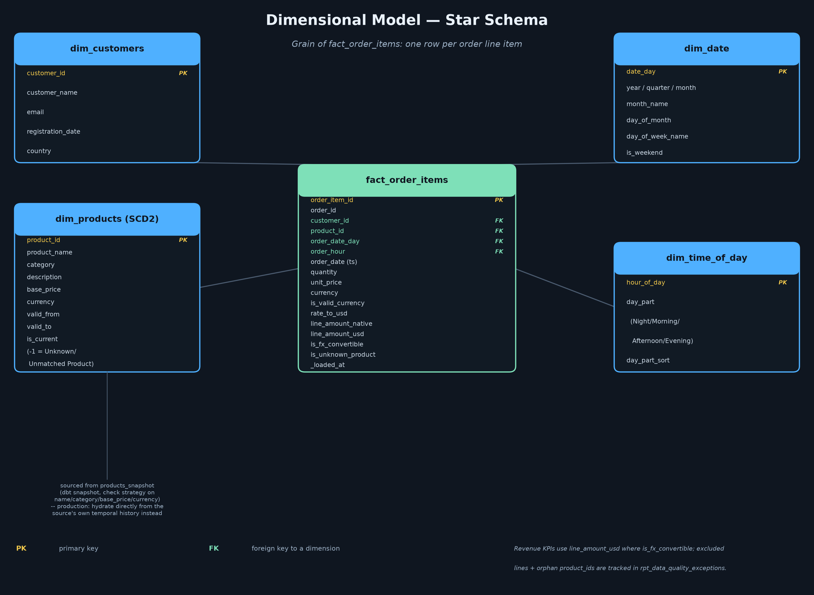

# Design Process — eCommerce Data Platform (Senior Data Engineer Challenge)

Target stack: **GCP** (BigQuery, GCS, Cloud Composer, Datastream) · **dbt** for transformation ·
**Looker Studio** for reporting. The local, actually-runnable build in this repo uses **dbt + DuckDB**
as a stand-in for BigQuery (see [Why DuckDB locally](#why-duckdb-locally)); every model is written so
the production port to BigQuery is close to mechanical, and `sql/ddl_bigquery.sql` gives the literal
BigQuery-dialect equivalent.

Source data is the canonical challenge dataset in `reference/data_engineer_assets/` (`source_sales.sql`,
`source_products.sql`, `sample_fx_rates.json`) — real operational data, inconsistencies included, not a
synthetic fixture built to look clean.

## Contents

- [Architecture](#architecture)
- [Dimensional model](#dimensional-model)
- [Ingestion & transformation strategy](#ingestion--transformation-strategy)
- [Data quality](#data-quality)
- [DevOps / CI-CD](#devops--ci-cd)
- [Business questions](#business-questions)
- [BI mockup](#bi-mockup)
- [Why DuckDB locally](#why-duckdb-locally)
- [What I'd do with more time](#what-id-do-with-more-time)

---

## Architecture


**Flow:** Sales DB + Product DB (SQL Server, system-versioned/temporal) → **Datastream** CDC → GCS
landing zone (immutable, partitioned by extract date) → BigQuery `raw` dataset → **dbt** (staging →
intermediate → marts, orchestrated by **Cloud Composer**) → BigQuery `marts` dataset → **Looker Studio**.
The Currency API is pulled separately by a scheduled Composer DAG (it's a pull API, not a
change-tracked database, so it doesn't fit the CDC path).

Design choices worth calling out:

- **CDC over the temporal tables, not full extracts.** Both `orders` and `product_descriptions` are
  `SYSTEM_VERSIONING`-enabled SQL Server tables — the source already tells you exactly what changed and
  when. Datastream (or a Debezium-based alternative) reads that change stream directly rather than
  re-scanning the whole table every run, which is the only sane approach once "assume production
  scale (millions of orders)" is a stated constraint.
- **GCS as an immutable landing zone**, not straight CDC-to-BigQuery. It's the reprocessing safety net:
  if a transformation bug ships, or the FX-join logic needs revisiting, you replay from GCS instead of
  re-pulling from source systems that may have already purged history.
- **dbt owns everything from `raw` onward.** Nothing downstream of the raw dataset is hand-written SQL
  outside dbt — staging, SCD2 snapshot, marts, and the two business-question reporting models are all
  dbt models with tests, so the transformation logic is version-controlled, tested, and diffable in PRs.
- **Data-quality exceptions get their own path**, not just inline flags. Bad rows are never dropped
  silently — they're flagged, included in the fact table with flags, *and* surfaced in a dedicated
  `rpt_data_quality_exceptions` model an ops process can alert on. See [Data quality](#data-quality).

## Dimensional model



Grain of `fact_order_items`: **one row per order line item**. That's the finest grain the source
supports and the one both business questions need — Q1 (top products) rolls up by `product_id`, Q2
(promo timing) rolls up by `order_hour`; a coarser order-level grain would force choosing a single
product/price per order and lose exactly the detail both questions ask for.

| Table | Type | Notes |
|---|---|---|
| `dim_customers` | Type-1 | No history requirement was called out for customers, so no SCD2 overhead. |
| `dim_products` | **Type-2 SCD** | Price/category change over time per the source's own temporal table — the challenge dataset's README calls this out explicitly. Built from a `dbt snapshot` (`check` strategy on name/category/base_price/currency) over `stg_products`. Includes a `product_id = -1` **"Unknown / Unmatched Product"** placeholder row — see [Data quality](#data-quality). |
| `dim_date` | Static spine | Calendar attributes for date-level rollups. |
| `dim_time_of_day` | Static spine | 24 hours, bucketed into Night/Morning/Afternoon/Evening — this is what Q2 (promo timing) actually groups by; a daily `dim_date` alone can't answer a time-of-day question. |
| `fact_order_items` | **Incremental** | USD-normalized, FX/product-quality flags carried as columns (not silently resolved), partitioned by `order_date_day` and clustered by `(product_id, customer_id)` in the BigQuery DDL for the date-range + rollup access pattern both business questions use. |

**Product dimension and fact binding.** In production, once the source's temporal history has more than
one version per product, `fact_order_items` should resolve the dimension row valid *at `order_date`*
(`valid_from <= order_date < valid_to`), not just the current version — a sale made before a price
change should report against the price that was actually charged. The local build joins on the natural
key only, because the single-snapshot sample dataset has no real version history to bind against yet;
`fact_order_items.sql` documents this explicitly so it doesn't read as an oversight.

## Ingestion & transformation strategy

**Incremental over full refresh**, driven by a `_loaded_at` watermark stamped by the EL layer at landing
time (not recomputed on every dbt run — see the code comment in `stg_orders.sql` for why that
distinction matters: recomputing it per-run would re-stamp every row on every run and defeat the
watermark entirely). `fact_order_items` is a dbt incremental model:

```sql

where _loaded_at > (select coalesce(max(_loaded_at), timestamp '1900-01-01') from {{ this }})

```

Locally this runs as `delete+insert` keyed on `order_item_id` (DuckDB's supported incremental
strategies); on BigQuery it becomes a native `MERGE` (see `sql/ddl_bigquery.sql`,
`sp_load_fact_order_items`) — same semantics, pushed down natively instead of two statements.

**This is demonstrated, not just described.** `scripts/extract_seeds.py` splits the real order data into
two batches with baked-in watermarks (batch 1 = orders 1-300, `_loaded_at = 2025-01-01`; batch 2 = the
remaining 153 orders, `_loaded_at = 2025-01-02`), simulating an initial historical backfill followed by
the next nightly incremental run:

```
$ dbt seed && dbt snapshot && dbt run --vars '{"orders_seed": "raw_orders_batch1", "order_items_seed": "raw_order_items_batch1"}'
  -> fact_order_items: 303 rows, max(_loaded_at) = 2025-01-01 02:00:00

$ dbt run   # default vars = full seed, i.e. "the next batch landed"
  -> fact_order_items: 363 rows  (delta = exactly the 60 batch-2 order_items; 0 duplicates on order_item_id)
```

See `README.md` → "Incremental load demo" to reproduce this.

**SCD2 for products** uses a `dbt snapshot` locally (`snapshots/products_snapshot.sql`, `check` strategy).
In production, since `product_descriptions` is *already* a system-versioned temporal table, the better
design is to **forward the source's own `valid_from`/`valid_to` history directly** into `dim_products`
(via the same Datastream CDC feed) rather than have dbt re-derive history by diffing successive runs.
dbt snapshot's diff-based approach is the right tool when the source has no native versioning; here it's
mainly a way to demonstrate the SCD2 mechanism against a source that doesn't expose its history through
the sample fixture. The design doc's honesty about this tradeoff matters more than pretending dbt
snapshot is the "correct" production answer when the source already does the job better.

**FX normalization is an as-of join, not an exact-date join.** The sample FX fixture only has rates for
two dates in 2024 while orders span the whole year — the same shape of problem as a real FX table with
gaps from weekends, holidays, or provider outages. `int_order_items_usd.sql` takes the closest available
rate to `order_date` for that currency (preferring same-day-or-earlier, falling back to the nearest later
rate for orders that predate all available history) instead of requiring an exact match that would just
silently produce nulls for most rows.

## Data quality

The brief is explicit that this is real operational data with real inconsistencies, and that "part of
the exercise is deciding how your design detects, handles and reports on data-quality problems rather
than silently propagating them." Two issues actually show up in the sample data:

| Issue | Scope | Handling |
|---|---|---|
| **Non-ISO-4217 currency codes** (`XYZ`, `ABC`, `QWE` — the FX API's own docs show it would reject these) | 75 of 363 order lines (21%) | Flagged (`is_valid_currency`, `is_fx_convertible`), **not dropped**. `line_amount_usd` is left `NULL` for unconvertible lines rather than defaulted to some rate that would misstate revenue. Revenue KPIs (`rpt_top_products`, `rpt_promo_time_of_day`) sum only FX-convertible lines. |
| **Orphan `product_id`** — `order_items.product_id` is intentionally not a FK upstream, and ~71 of 363 lines (20%) reference a `product_id` absent from the catalogue | 71 of 363 order lines | Rolled up under a `product_id = -1` **"Unknown / Unmatched Product"** row in `dim_products`, so the relationship test between `fact_order_items` and `dim_products` stays green (nothing silently fails referential-integrity checks) *and* volume/revenue totals still reconcile to the full fact table. Excluded from the top-products business answer specifically — see below. |

68 of the 363 lines trip **both** checks at once, which is why `rpt_data_quality_exceptions` reports
reasons as independent flags (`flag_invalid_currency_code`, `flag_product_id_not_in_catalogue`) instead
of a single "first match wins" category — collapsing overlapping issues into one bucket undercounts both
and was an actual bug caught while building this (see git history / the comment in
`rpt_data_quality_exceptions.sql`).

**Why `rpt_top_products` excludes the `-1` bucket:** left in, "Unknown / Unmatched Product" would rank
#1 by volume (174 units across those 66 orphan-and-bad-currency lines) purely because it's a rollup of
otherwise-unrelated line items, not because it's a real top performer. An answer to "which *products*
are top performers" has to be about real products; the exclusion is documented in the model's SQL
comment and the exceptions are fully accounted for separately, not just discarded.

**Not corrected in this design:** neither issue is "fixed" by inferring a real currency or product —
there's no reliable signal in the data to do that correctly, and guessing would be worse than flagging.
This is a judgment call a production rollout would confirm with the Sales/Product system owners
(is `XYZ` a known internal test currency? are the orphan `product_id`s from a since-deleted catalogue
range?) rather than one a warehouse should silently paper over.

## DevOps / CI-CD

- **Infrastructure as code (Terraform):** BigQuery datasets (`raw`, `marts`), IAM bindings, Composer
  environment, and the GCS landing bucket are all Terraform-managed — no console-created resources.
- **dbt on every PR (slim CI):** GitHub Actions runs `dbt build --select state:modified+` against a
  PR-scoped BigQuery dataset (via `dbt-bigquery`'s state comparison), so a PR only rebuilds and tests
  what it actually touched rather than the whole DAG — critical once the mart layer is
  millions-of-rows-scale.
- **Tests as the merge gate**, not a nice-to-have: schema tests (`not_null`, `unique`, `relationships`)
  fail the build; data-quality tests on `is_valid_currency` use `severity: warn` deliberately (see
  `_staging.yml`) because failing invalid currency codes would mean the *known, already-designed-for*
  data quality issue blocks every single CI run — the point of flagging is to make it visible and
  queryable, not to treat production data reality as a bug to gate merges on.
- **On merge to `main`:** deploy job runs `dbt run` against the production dataset, then `dbt docs
  generate` publishes updated lineage docs (hosted, e.g., on GCS + Cloud Run or dbt Cloud's docs site)
  so downstream analysts always have current column-level lineage without asking a data engineer.
- **Orchestration:** Cloud Composer (managed Airflow) sequences CDC landing confirmation → `dbt seed`
  (reference data) → `dbt snapshot` (SCD2) → `dbt run` → `dbt test`, with Slack/PagerDuty alerting on
  task failure and a separate low-urgency alert channel for `rpt_data_quality_exceptions` volume
  crossing a threshold (distinct from a pipeline failure — the pipeline succeeding while flagging *more*
  bad data than usual is itself a signal worth a human looking at).

## Business questions

Both are answered with real numbers computed by the actual local dbt build (`dbt/warehouse.duckdb`) —
not illustrative placeholders. Reproduce with `python scripts/build_bi_mockup.py` after `dbt build`.

### Q1 — Which products are the top performers in sales volume and revenue?

Revenue and volume leaders are **different products** — a pattern worth designing the dashboard around,
not collapsing into one ranking:

- **By revenue:** USB-C Hub 7-in-1 ($1,693.60, Electronics) leads; the top 8 are dominated by
  higher-ticket Electronics/Books/Home & Garden items.
- **By volume:** Dog Training Treats (40 units, Pet Supplies) leads; volume leaders skew toward
  low-ticket, repeat-purchase categories (Pet Supplies, Automotive).
- Total, across the full (real-product, FX-convertible) dataset: **$81,326 revenue, 988 units, 360
  distinct orders** contributing clean data.

A promotions or merchandising team needs both cuts, which is why `rpt_top_products` exposes
`rank_by_volume` and `rank_by_revenue` as separate columns rather than one blended score.

### Q2 — What is the optimal time of day to run sales promotions?

Order activity is concentrated in a **business-hours window (09:00-17:00)** with essentially zero
activity overnight (00:00-08:00, 19:00-23:00) in this dataset. Within that window:

- **Order volume peaks at 14:00** (52 orders).
- **Revenue peaks at 15:00** ($11,463), despite slightly fewer orders (49) than 14:00 — average order
  value is higher at 15:00 ($293.94 vs. $251.33), so revenue and order-count peaks don't quite coincide.

**Recommendation:** run promotions in the **14:00-16:00** window rather than pinning to a single hour —
it captures both the volume peak and the revenue peak, which don't fall on the same hour.

## BI mockup


Wireframe for a two-panel Looker Studio report connected directly to the BigQuery marts
(`dim_products`, `dim_time_of_day`, `fact_order_items`) — no intermediate export step. KPI cards up top
(revenue, units, orders, % of lines flagged by data-quality checks) give an at-a-glance health check
before drilling into either business question; the DQ-exceptions tile is deliberately on the main report,
not hidden in a separate ops-only dashboard, because a promotions team deciding *when* to run a
promotion should know if 21% of line items had a data-quality flag that quarter.

## Why DuckDB locally

The challenge email asked for GCP/BigQuery/Looker specifically, *and* for the project to "run locally."
Those two asks are in tension for a take-home: a real BigQuery project needs a GCP account, billing, and
credentials a reviewer running this outside a browser doesn't necessarily have on hand. The dbt project
in this repo runs against **DuckDB** so `git clone && dbt build` works with zero cloud setup, while every
model is written in dbt's cross-database SQL and every genuinely BigQuery-specific piece (partitioning,
clustering, native `MERGE`, `GENERATE_ARRAY`) is captured verbatim in `sql/ddl_bigquery.sql`. The two are
kept in lockstep by naming and structuring the dbt models 1:1 with that file, so nothing in the design is
DuckDB-specific in spirit — it's a substitution for the local run, not a different design.

## What I'd do with more time

- **Real version history for `dim_products`** to actually exercise the as-of fact-to-dimension join
  described above (the sample data only has one snapshot in time).
- **A live Looker Studio report** connected to a real BigQuery project, instead of a wireframe — held
  back by the same local-run constraint discussed above, not by the design.
- **dbt unit tests** (dbt 1.8+ `unit_tests:`) on the FX as-of join and the orphan-product placeholder
  logic specifically, since both have edge-case behavior (rate-history gaps, unmatched products) that's
  easy to regress silently.
- **Great Expectations or dbt's `elementary` package** for anomaly detection on the DQ-exception rate
  itself (alert if the flagged-line percentage moves outside its historical range), rather than only a
  static threshold.
